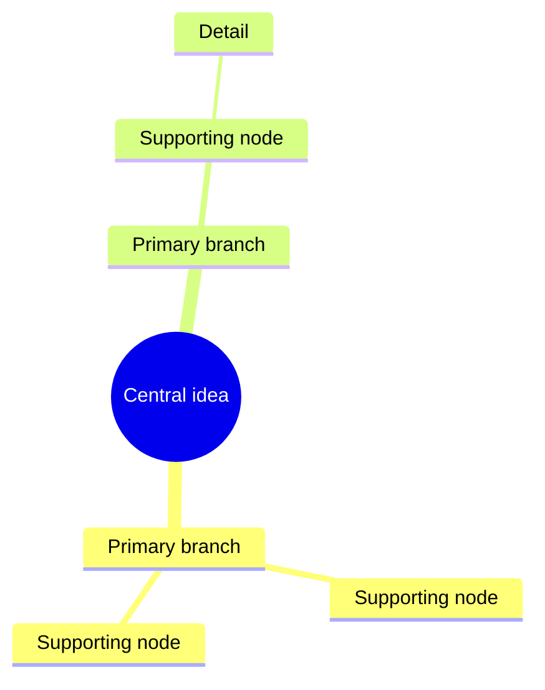

# Create Mindmap

## Overview

Create a concise, balanced mind map that makes relationships easy to scan. Prefer a practical structure over exhaustive transcription.
When generating saved HTML artifacts, keep the interaction model and visual structure consistent across runs: use the same family of hierarchical, foldable node-based mind map UI unless the user explicitly asks for a different presentation.

## Workflow

1. Identify the central idea.
   - Use the user's explicit title when provided.
   - If no title is provided, infer a short noun phrase from the source.
   - Infer the central idea from the user's purpose or framing, not from one arbitrary top-level branch. For example, if the branches are "AGI era", "physical robots", "space", and "energy" and the request asks for investment stocks, use a central idea such as "future stock themes" or "future industry investment themes" rather than "AGI era".

2. Extract primary branches.
   - Use 4-8 top-level branches for most maps.
   - Prefer action, concept, stakeholder, timeline, decision, risk, resource, or outcome categories when they match the material.
   - Merge duplicates and split overloaded branches.

3. Add supporting nodes.
   - Keep each node short: usually 1-6 words.
   - Preserve important numbers, dates, owners, dependencies, and constraints.
   - Put examples and evidence under the concept they support.
   - Mark uncertainty only when it affects the structure or next action.

4. Choose the output format.
   - Use Markdown outline by default when the user wants readable text.
   - Use Mermaid `mindmap` when the user asks for Mermaid, diagrams, renderable output, or a file-friendly format.
   - When creating an HTML mind map deliverable, build an actual mind map UI with hierarchical nodes and node-level folding/collapse. Do not substitute a static card grid, dashboard, or section layout for a mind map.
   - Use a table only for comparing alternative structures, not as the final map unless requested.

5. Check the map.
   - Ensure every child node supports its parent.
   - Avoid single-child chains unless they express a necessary sequence.
   - Remove filler such as "overview", "misc", or "details" unless the source truly requires it.
   - Keep sibling labels parallel in grammar where practical.

6. Create a source data Markdown file when generating files.
   - When the user asks for a mind map file, HTML deliverable, renderable artifact, or any saved output, also create a companion `*.md` file containing the source data used to build the map.
   - Unless the user explicitly provides filenames, derive a short lowercase English slug from the central idea or use case and use `{keyword}.codex.md` for the source data file and `{keyword}.codex.html` for the HTML output, for example `energy.codex.md` and `energy.codex.html`.
   - If the central idea needs multiple words, use hyphenated English keywords, for example `future-energy.codex.md` and `future-energy.codex.html`.
   - Do not choose a filename from only one branch when multiple sibling branches define the map. Prefer purpose words such as `stock`, `investment`, `industry`, `future`, or `themes` when the content is about investable sectors or listed companies.
   - If the user explicitly provides an output filename, honor that filename and use the same base filename for the source data file.
   - Include the central idea, normalized outline, and any source notes, assumptions, dates, owners, constraints, or unresolved questions that shaped the map.
   - Keep this file as the editable data source for future regeneration; do not make it a prose explanation unless the user asks for one.

## Markdown Output

Use this shape:

```markdown
# Central idea

- Primary branch
  - Supporting node
  - Supporting node
- Primary branch
  - Supporting node
    - Detail
```

Prefer Markdown when the user needs to paste the result into notes, docs, chat, or task planning.

## Mermaid Output

Use this shape:



For Mermaid:

- Keep labels plain and short.
- Quote labels only when Mermaid syntax requires it.
- Avoid punctuation-heavy labels, markdown formatting, and long sentences.
- If a label contains problematic characters, simplify it rather than escaping heavily.

## HTML Mind Map Output

When generating an HTML deliverable:

- The first screen must be a usable mind map, not a static card layout.
- Use a consistent reusable structure for similar requests: central root, visible parent-child links, node rectangles, node-level fold controls, and top-level view controls.
- Nodes with children must support click or button-based folding and expansion.
- Level controls must be generated from the actual maximum depth of the data, not hard-coded to a single level. If the map has depths 1-4, expose level buttons for each useful depth such as `1단계`, `2단계`, `3단계`, `4단계` plus `전체 펼침`.
- The initial expanded depth should be chosen from the data shape, normally showing root and primary branches first for dense maps, while allowing the user to reveal deeper levels through generated level buttons.
- Keep node folding clicks separate from canvas pan/drag handlers. Node pointer events should stop propagation or otherwise avoid being swallowed by viewport dragging.
- After a node folds or expands, re-layout and refit or recenter the map so the newly visible children are reachable.
- Preserve visible parent-child links so the hierarchy is clear before and after folding.
- Include basic viewport controls such as fit, zoom, or pan when the map is larger than the screen.
- Use compact default typography for HTML maps: smaller node text, smaller root text, and stable node dimensions so dense maps remain readable without oversized labels.
- Keep a companion Markdown source file as the editable data source.
- Verify the HTML by rendering a screenshot and, when local tooling is available, by testing at least one node expand/collapse interaction.

## Expansion From A Topic

When the user gives only a topic, create a useful starter map instead of asking for more input. Use this structure unless the topic suggests a better one:

- Core concept
- Main components
- Process or timeline
- Use cases
- Risks or tradeoffs
- Examples
- Next steps

State briefly that the map is an inferred starter structure when important.

## Condensing Existing Material

When the user provides notes or a transcript:

- Preserve the source's actual meaning and priorities.
- Group repeated points instead of duplicating them.
- Lift decisions, tasks, risks, and unresolved questions into visible branches.
- If the source is messy, create a clean structure first, then place details under it.

## Refinement Requests

For requests such as "make it simpler", "more detailed", "presentation-ready", or "for studying":

- Simpler: reduce top-level branches and remove low-value details.
- More detailed: add one level of meaningful subnodes before adding breadth.
- Presentation-ready: use polished labels, fewer branches, and outcome-focused wording.
- Study-oriented: emphasize definitions, relationships, examples, and recall cues.
- Planning-oriented: emphasize goals, milestones, owners, dependencies, risks, and next actions.
